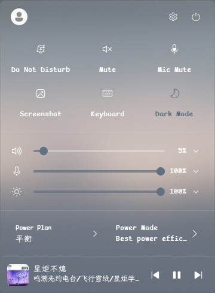
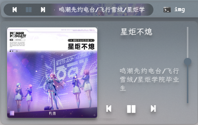
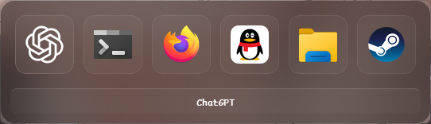

# YASB 2.0.6 亚克力桌面状态栏配置

一套面向 Windows 11 与 [YASB Reborn](https://yasb.dev/) 2.0.6 的个人状态栏配置。

主题以 Windows 动态强调色为基础，使用半透明白色蒙版、DWM 模糊和圆角构建轻量亚克力界面。配置包含重新设计的媒体播放器、Control Center、Todo、Quick Launch、窗口切换器、壁纸画廊、任务栏、硬件状态和电源菜单。

> 当前配置默认只在主显示器显示。YASB 的程序版本建议使用 2.0.6；Control Center 等组件在较旧版本中不可用。

演示视频（及安装教程）：<https://www.bilibili.com/video/BV1vCb26hEun/?vd_source=958633e12684eb6031a43772ebfbd213#reply310765040497>

## 效果预览

### 整体桌面


### 状态栏


### Control Center

Control Center 集成勿扰、系统静音、麦克风静音、截图、触摸键盘、深浅模式、亮度、音量、麦克风、电源计划和媒体控制。主面板及二、三级菜单统一为无阴影亚克力风格。



### 媒体播放器

状态栏继续使用经典 `MediaWidget`，保留专辑封面、标题滚动、内嵌播放控制和进度条；右键弹出的播放器经过重新布局，使用更大的封面、圆形控制键、播放进度和应用音量滑杆。



### Todo

Todo 支持新增、编辑、分类、完成、删除和排序任务。任务类别包括常规、尽快完成、今日、紧急和重要。


### Quick Launch 与窗口切换

按 `Alt + Space` 打开 Quick Launch，搜索应用、文件、系统设置和最近项目。


按 `Alt + W` 打开窗口切换器。



### 电源菜单与任务栏菜单


## 功能亮点

- **系统动态配色**：`system_colors: true` 会读取 Windows 强调色、背景色和前景色。
- **白色亚克力蒙版**：弹窗主要使用固定的白色 `rgba()` 调整透明度，避免主题变量造成过深黑色遮罩。
- **无残留阴影**：交互面板使用 `box-shadow: none`，避免 Qt 在悬停或点击后留下黑色矩形。
- **Control Center**：在一个面板中集中管理常用系统开关、滑杆、电源和媒体。
- **经典媒体栏 + 新弹窗样式**：保留旧媒体组件的状态栏控制方式，同时重新设计播放器弹窗。
- **Todo 任务管理**：直接从状态栏新增、分类和完成任务。
- **Quick Launch**：支持应用、文件和设置搜索，可通过全局快捷键呼出。
- **窗口切换器**：以图标视图快速查找并切换窗口。
- **壁纸画廊**：中央大图预览、键盘和滚轮翻页，并使用圆形扩散过渡。
- **模块化样式**：主样式按功能拆分，便于独立调整和维护。

## 状态栏布局

当前状态栏高度为 32px，并只显示在主显示器：

| 区域 | 组件 |
| --- | --- |
| 左侧 | 媒体播放器、活动窗口标题 |
| 中间 | 日期时间、Quick Launch、常用应用启动器 |
| 右侧 | 壁纸、GitHub、窗口切换器、任务栏、网速、Wi-Fi、CPU、内存、蓝牙、WHKD、音量、Todo、Control Center、电源菜单 |

独立的 DND 组件配置仍保留在 `config.yaml`，但没有直接加载到状态栏；勿扰功能可通过 Control Center 使用。

## 快捷键

| 快捷键 | 功能 | 弹窗内操作 |
| --- | --- | --- |
| `Alt + Space` | 打开或关闭 Quick Launch | `↑` / `↓` 选择，`Enter` 打开，`Esc` 关闭 |
| `Alt + W` | 打开或关闭窗口切换器 | `←` / `→` 选择，`Enter` / `Space` 切换，`Delete` 关闭窗口 |
| `Alt + P` | 打开或关闭壁纸画廊 | `←` / `→` 或滚轮翻页，`Enter` 应用，`Esc` 关闭 |

若全局快捷键没有响应，请检查 PowerToys、输入法、窗口管理器或其他软件是否占用了相同组合键。

## 常用操作

### 媒体

- 左键点击媒体栏：播放或暂停。
- 中键点击：切换标题与歌手的显示顺序。
- 右键点击：打开重新设计的媒体弹窗。
- 弹窗提供封面、上一首、播放/暂停、下一首、时间轴和应用音量。

部分播放器或浏览器不会向 Windows 媒体 API 提供可靠的时间轴或应用音频会话；此时进度拖动或音量控制可能不可用。

### Todo

- 左键点击 Todo：打开任务面板。
- 右键点击：切换任务计数显示。
- 支持常规、尽快完成、今日、紧急和重要五种分类。
- YASB 会在配置目录生成 `todo.json` 保存任务。

Todo 主面板支持原生模糊。新增/编辑任务窗口在 YASB 2.0.6 中由普通 Qt `QDialog` 实现，没有调用 DWM backdrop，因此只能通过 CSS 获得玻璃拟态，无法仅靠主题实现真正的背景模糊。

### Control Center

- 左键点击齿轮图标打开面板。
- 快捷开关包含勿扰、静音、麦克风静音、截图、触摸键盘和深浅模式。
- 滑杆区域包含亮度、输出音量和麦克风音量，并支持来源选择。
- 电源区域可切换 Power Plan 与 Power Mode。
- 子菜单使用白色透明底板且禁用阴影，以避免鼠标交互后残留黑框。

### 窗口切换器

点击窗口切换图标或按 `Alt + W` 打开。弹窗跟随鼠标所在屏幕，支持键盘选择、切换和关闭窗口。

### 壁纸画廊

- 点击壁纸图标或按 `Alt + P` 打开。
- 每页显示一张 640px 宽的横向预览。
- 使用方向键或滚轮切换，按 `Enter` 应用。
- 壁纸应用时使用 `circle` 圆形扩散动画。
- 默认壁纸目录为 YASB 配置目录下的 `wallpapers/`。

### 实时网速

- 状态栏显示当前下载和上传速度。
- 左键打开网络详情菜单。
- 右键切换简洁标签和中文详细标签。

### 电源菜单

点击最右侧电源图标，可选择关机、重启、退出登录、休眠或睡眠。执行操作前请保存工作。

## 使用要求

### YASB

安装 YASB Reborn 2.0.6：

```powershell
winget install --id AmN.yasb
```

检查当前版本：

```powershell
yasbc -v
```

### 字体

建议安装以下字体，否则部分图标、中文或英文可能显示为方框：

- ComicShannsMono Nerd Font
- JetBrainsMono Nerd Font / JetBrainsMono NFP
- Symbols Nerd Font Mono
- LXGW WenKai Mono（霞鹜文楷等宽版）

主题的英文优先使用 ComicShannsMono Nerd Font，中文回退到 LXGW WenKai Mono；图标控件使用 Nerd Font 或 Segoe Fluent Icons。

### Windows 设置

建议在“设置 → 个性化 → 颜色”中开启“透明效果”。系统关闭透明效果、省电模式或远程桌面环境可能让亚克力退化为普通半透明背景。

如果启用 Komorebi、WHKD、天气、GitHub 或自定义应用启动项，还需要安装对应程序并配置必要的环境变量。

## 安装

YASB 默认从 `%USERPROFILE%\.config\yasb\` 读取配置。请先备份自己的文件，然后把仓库中的配置、样式入口和整个 `styles/` 目录复制过去。

在仓库根目录运行：

```powershell
$yasbDir = Join-Path $env:USERPROFILE ".config\yasb"
New-Item -ItemType Directory -Force -Path $yasbDir | Out-Null

Copy-Item -LiteralPath ".\config.yaml" -Destination $yasbDir -Force
Copy-Item -LiteralPath ".\styles.css" -Destination $yasbDir -Force
Copy-Item -LiteralPath ".\styles" -Destination $yasbDir -Recurse -Force
```

如需天气和 GitHub 通知，再创建 `.env`：

```powershell
Copy-Item -LiteralPath ".\.env.example" -Destination (Join-Path $yasbDir ".env") -Force
```

编辑 `.env`：

```dotenv
YASB_WEATHER_API_KEY=YOUR_WEATHER_API_KEY
YASB_WEATHER_LOCATION=YOUR_CITY_OR_POSTAL_CODE
YASB_GITHUB_TOKEN=YOUR_GITHUB_TOKEN
```

不要提交真实 Token、API Key 或精确位置。

最后重新加载 YASB：

```powershell
yasbc reload
```

## 系统颜色文件

`config.yaml` 已启用：

```yaml
system_colors: true
```

YASB 启动后会在配置根目录自动生成 `yasb_colors.css`。该文件的生成位置由 YASB 固定管理，不建议移动或手动修改；删除后，下次启动仍会重新生成。

`styles.css` 必须首先导入它：

```css
@import "yasb_colors.css";
```

## 样式模块

```text
styles.css
styles/
├─ 00-base.css
├─ 01-media.css
├─ 02-launchers-workspaces.css
├─ 03-menus-and-utilities.css
├─ 04-system-widgets.css
├─ 05-window-tools.css
├─ 06-control-center.css
└─ 07-todo.css
```

| 文件 | 内容 |
| --- | --- |
| `00-base.css` | 全局字体、动态颜色映射、状态栏基础样式 |
| `01-media.css` | 媒体栏、播放器弹窗、时间轴和应用音量 |
| `02-launchers-workspaces.css` | Quick Launch、应用启动器及工作区相关样式 |
| `03-menus-and-utilities.css` | 通用菜单、任务栏菜单、壁纸及工具弹窗 |
| `04-system-widgets.css` | CPU、内存、网络、Wi-Fi、蓝牙等系统组件 |
| `05-window-tools.css` | 活动窗口和窗口切换器 |
| `06-control-center.css` | Control Center 主面板与子菜单 |
| `07-todo.css` | Todo 主面板、任务项、新增/编辑窗口和上下文菜单 |

> 若 Todo 能运行但仍显示默认样式，请确认 `styles.css` 末尾包含 `@import "styles/07-todo.css";`。

## 本地路径与应用启动项

应用启动器中包含 QQ 音乐、VS Code、Firefox、资源管理器、QQ、微信和其他本地程序。程序必须已加入 `PATH`，或在 `widgets.apps.options.app_list` 中替换为本机绝对路径。

壁纸组件默认使用：

```yaml
image_path: "wallpapers"
```

请在实际 YASB 配置目录准备 `wallpapers/`。如果相对路径无法识别，请改成绝对路径。

## 多显示器

当前配置只在主显示器显示：

```yaml
screens: ["primary"]
```

希望在所有未分配显示器显示时，可改为：

```yaml
screens: ["*"]
```

Quick Launch 固定在主屏打开；窗口切换器和壁纸画廊跟随鼠标所在屏幕。可在对应 `keybindings` 下调整 `screen`。

## 自定义建议

- 调整组件顺序：编辑 `bars.primary-bar.widgets` 下的 `left`、`center`、`right`。
- 调整亚克力透明度：修改各模块中的 `rgba(255, 255, 255, alpha)`。
- 避免 Qt 黑框：弹窗根容器和交互控件保持 `box-shadow: none`。
- 调整字体：修改 `styles/00-base.css` 的全局字体栈。
- 调整媒体弹窗：编辑 `styles/01-media.css` 和 `widgets.media.options.media_menu`。
- 调整 Todo：编辑 `styles/07-todo.css` 和 `widgets.todo.options.categories`。
- 调整 Control Center：编辑 `styles/06-control-center.css` 和 `widgets.control_center.options.sections`。

`watch_config` 与 `watch_stylesheet` 已启用，保存后 YASB 通常会自动重新加载。若样式没有更新，可执行 `yasbc reload`。

## 数据与安全

- `.env` 已被 `.gitignore` 排除，但已经进入 Git 历史的密钥仍然可以被恢复。
- Todo 数据保存在 `todo.json`；其中可能包含私人任务，决定提交前请先检查内容，或自行将其加入 `.gitignore`。
- 上传截图前，请检查账户头像、通知内容、歌曲信息、窗口标题和桌面文件名。
- 如果密钥曾被提交，应先在服务商后台撤销或轮换，再清理 Git 历史。

## 已知限制

- Control Center、Todo 与其他新组件要求兼容的 YASB 版本，推荐 2.0.6。
- Todo 新增/编辑窗口是普通 Qt `QDialog`，2.0.6 中无法仅通过 CSS 获得真正的 DWM 亚克力。
- 媒体时间轴和应用音量依赖播放器向 Windows 媒体 API 提供数据。
- 不同壁纸亮度会影响白色透明蒙版的文字可读性，可按需提高 alpha。
- YASB 使用 Qt 样式系统，并非浏览器 CSS；部分 CSS3 属性和复杂布局不受支持。

## 参考与致谢

本主题参考了 [amnweb/yasb-themes](https://github.com/amnweb/yasb-themes) 中的 Acrylic 与 Yasb 004，并在此基础上进行了模块拆分、动态强调色适配和弹窗重设计。

- [YASB 官方文档](https://docs.yasb.dev/latest/)
- [样式与系统颜色](https://docs.yasb.dev/latest/styling)
- [Control Center](https://docs.yasb.dev/latest/widgets/control-center)
- [Media](https://docs.yasb.dev/latest/widgets/media)
- [Todo](https://docs.yasb.dev/latest/widgets/todo)
- [Quick Launch](https://docs.yasb.dev/latest/widgets/quick-launch)
- [窗口切换器](https://docs.yasb.dev/latest/widgets/window-switcher)
- [壁纸组件](https://docs.yasb.dev/latest/widgets/wallpapers)

感谢 YASB 作者和社区维护者提供组件、文档与主题灵感。
