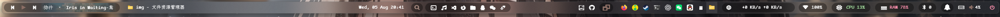
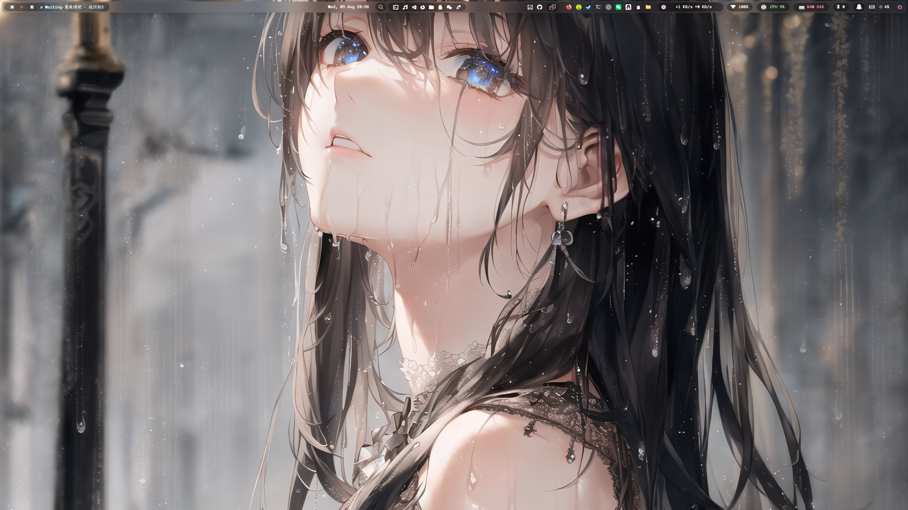
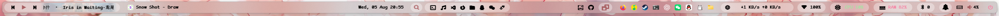
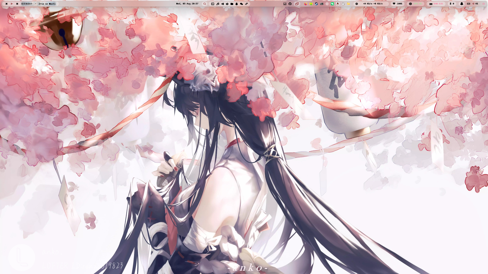
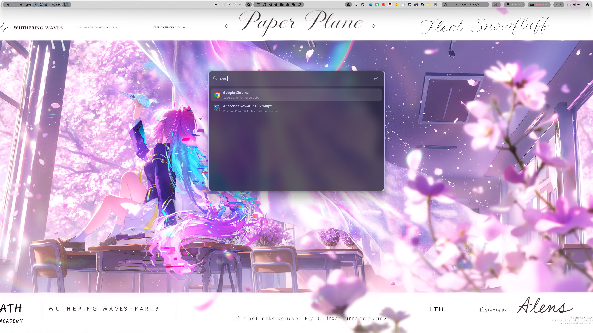
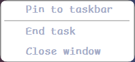
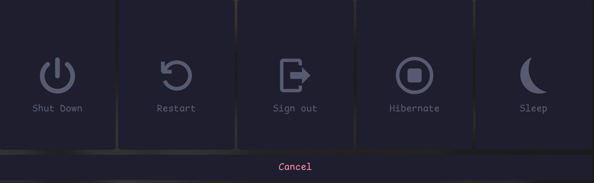

# YASB Catppuccin 桌面状态栏配置

一套面向 Windows 的 [YASB Reborn](https://yasb.dev/) 配置，以 Catppuccin Mocha 配色、半透明圆角容器和紧凑的信息布局为主。配置包含媒体控制、应用启动、快速搜索、系统监控、网络状态、GitHub 通知、壁纸切换等组件。

## 效果预览

### 深色模式





### 浅色桌面搭配

> 配置本身使用深色半透明样式，也可以搭配浅色壁纸使用。





### 快速搜索

按 `Alt + Space` 打开 Quick Launch。



## 主要组件

- 左侧：媒体信息与控制、活动窗口标题
- 中间：日期时间、Quick Launch、常用应用启动器
- 右侧：壁纸、GitHub 通知、任务栏、实时网速、Wi-Fi、CPU、内存、蓝牙、WHKD、音量和电源菜单

## 基本操作

### 媒体控制

状态栏左侧的媒体组件会显示当前曲目、艺术家和封面缩略图，并提供上一首、播放/暂停和下一首按钮：

- 点击上一首或下一首按钮切换曲目。
- 点击播放/暂停按钮控制当前媒体。
- 左键点击媒体信息区域也可以切换播放/暂停状态。
- 中键点击媒体信息区域可以切换标题和艺术家的显示顺序。
- 右键点击媒体信息区域可以打开详细媒体菜单，查看封面和来源，并使用音量滑块。

### 应用启动与窗口切换

状态栏中间的常用应用图标属于应用启动器，点击后会启动对应程序。首次使用前，需要先按照下文说明替换 `config.yaml` 中的 `<PATH_TO_...>` 占位符。

状态栏右侧的任务栏图标代表当前正在运行的窗口：

- 左键点击后台或已最小化的应用图标，可以将对应窗口呼出并切换到前台。
- 左键点击当前处于前台的应用图标，可以将窗口最小化。
- 右键点击应用图标会打开窗口菜单，可根据实际状态选择固定到任务栏、结束任务或关闭窗口。部分操作可能需要相应权限。



### 快速搜索

点击状态栏中间的搜索图标，或按下 `Alt + Space`，可以打开 Quick Launch，用于搜索并启动应用、文件和系统设置。

### 电源菜单

点击状态栏最右侧的电源图标会呼出电源菜单。菜单提供关机、重启、退出登录、休眠和睡眠操作；不需要执行操作时点击 `Cancel` 关闭菜单。选择电源操作前，请先保存尚未完成的工作。



### 未验证组件声明

配置中还保留了天气、更新检查、Komorebi 工作区与布局以及 AI 快捷入口的定义，但这些组件本人没有实际使用过，也没有进行功能验证。它们仅作为可选配置保留，不能保证可以直接正常工作；如需启用，请结合当前版本的 [YASB 官方文档](https://docs.yasb.dev/latest/)自行检查和调整。

## 使用前准备

1. 安装 [YASB Reborn](https://docs.yasb.dev/latest/installation.html)。也可以使用 Winget：

   ```powershell
   winget install --id AmN.yasb
   ```

2. 安装配置所使用的字体。建议至少准备 Nerd Font，否则部分图标会显示为方框：

   - ComicShannsMono Nerd Font
   - JetBrainsMono Nerd Font / JetBrainsMono NFP
   - Symbols Nerd Font Mono
   - LXGW WenKai Mono（用于中文回退）

3. 如需使用对应组件，请另外安装并配置 Komorebi、WHKD，以及应用启动器中列出的软件。

## 安装配置

YASB 默认从 `%USERPROFILE%\.config\yasb\` 读取配置。将本仓库中的 `config.yaml` 和 `styles.css` 复制到该目录：

```powershell
$yasbConfigDir = Join-Path $env:USERPROFILE ".config\yasb"
New-Item -ItemType Directory -Force -Path $yasbConfigDir
Copy-Item .\config.yaml, .\styles.css -Destination $yasbConfigDir -Force
```

然后复制环境变量模板：

```powershell
Copy-Item .\.env.example (Join-Path $yasbConfigDir ".env")
```

编辑生成的 `.env`，填写需要使用的值：

```dotenv
YASB_WEATHER_API_KEY=YOUR_WEATHER_API_KEY
YASB_WEATHER_LOCATION=YOUR_CITY_OR_POSTAL_CODE
YASB_GITHUB_TOKEN=YOUR_GITHUB_TOKEN
```

`YASB_GITHUB_TOKEN` 应使用具有 `notifications` 权限的 GitHub Personal Access Token。GitHub 组件当前已加载，不需要时可从 `bars.primary-bar.widgets.right` 中移除 `github`。天气组件当前仅有定义、未加载，不使用时可以删除对应定义和环境变量。

## 必须修改的本地路径

打开 `config.yaml`，搜索 `<PATH_TO_`，根据本机实际安装位置替换这些占位符：

| 占位符 | 用途 |
| --- | --- |
| `<PATH_TO_QQMUSIC_EXE>` | QQ 音乐可执行文件 |
| `<PATH_TO_VSCODE_EXE>` | Visual Studio Code 可执行文件 |
| `<PATH_TO_BROWSER_EXE>` | 浏览器可执行文件；在应用启动器和 AI 快捷入口中各出现一次 |
| `<PATH_TO_QQ_EXE>` | QQ 可执行文件 |
| `<PATH_TO_WECHAT_EXE>` | 微信可执行文件 |
| `<PATH_TO_CLASH_NYANPASU_EXE>` | Clash Nyanpasu 可执行文件 |
| `<PATH_TO_WALLPAPER_DIRECTORY>` | 壁纸文件夹 |

示例：

```yaml
- { icon: "...", launch: 'D:\Apps\Example\Example.exe' }
```

如果不使用某个应用，直接删除 `widgets.apps.options.app_list` 中对应的一行即可。

关于磨砂玻璃效果： 如果磨玻璃效果没有的话，就去 设置->个性化->颜色里面，把透明效果打开，并且关闭省电模式

## 自定义

- 显示器：当前使用 `screens: ["primary"]`，会将状态栏放在主显示器；多显示器配置可参考 [YASB 配置文档](https://docs.yasb.dev/latest/configuration.html)。
- 组件位置：修改 `bars.primary-bar.widgets` 下的 `left`、`center` 和 `right`。
- 配色：编辑 `styles.css` 顶部的 Catppuccin CSS 变量。
- 字体：修改 `styles.css` 中全局 `font-family`。
- 栏高与间距：修改 `bars.primary-bar.dimensions`、`padding` 以及对应组件的 CSS。
- 自动重载：`watch_config` 和 `watch_stylesheet` 均已启用，保存文件后 YASB 会自动应用修改。

更多组件选项与样式类请参阅 [YASB 官方文档](https://docs.yasb.dev/latest/)。

## 参考与致谢

本主题在布局和视觉样式上，一定程度参考了 `amnweb/yasb-themes` 中由 [amnweb](https://github.com/amnweb) 发布的以下两个主题：

- [Acrylic](https://github.com/amnweb/yasb-themes/tree/main/themes/a93f1976-0c89-4593-b333-eaa374164c73)
- [Yasb 004](https://github.com/amnweb/yasb-themes/tree/main/themes/0892faae-d929-4c65-8689-4ef1de32f73d)

感谢原作者及 YASB 社区分享这些优秀的配置与设计思路。
